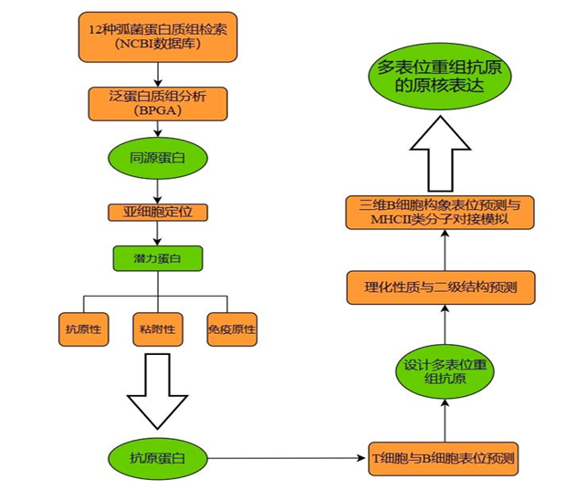

# CBBT Multi-Epitope Recombinant Antigen Design Manual

## 多表位重组抗原 CBBT 设计手册

This repository documents a research project completed at Shandong University as my undergraduate graduation project. At the invitation of my supervisor, I organized the workflow, protocols, representative results, and practical notes into this manual as a reference resource for undergraduate research training.

本项目是我在山东大学完成的一项课题，也是我的本科毕业设计。受老师邀请，我将课题中的研究流程、操作步骤、代表性结果与实践经验整理为本指导手册，供本科生科研训练与相关研究参考。

> This is an author-prepared educational resource and is not an official publication of Shandong University.  
> 本仓库为作者整理的科研训练资料，并非山东大学官方出版物。

## Project overview｜项目概述

The manual uses the design of the multi-epitope recombinant antigen **CBBT** against 12 commonly studied *Vibrio* strains as a worked example. It follows a complete route from comparative proteome analysis and candidate antigen screening to epitope prediction, recombinant antigen construction, in-silico quality assessment, and experimental expression.

本手册以面向 12 种常见弧菌的多表位重组抗原 **CBBT** 为示例，系统展示从比较蛋白质组分析、候选抗原筛选，到表位预测、重组抗原构建、计算质量评估及实验表达的完整路线。

The example workflow identifies conserved proteins through pan-proteome analysis, evaluates antigen candidates using subcellular localization, adhesin probability, antigenicity, and immunogenicity, and then focuses on the candidate proteins **BamA** and **TolC**. Selected B-cell and T-cell epitope-rich segments are assembled with a CTB molecular adjuvant, EAAAK/GPGPG linkers, and a His tag to form CBBT, followed by structural evaluation and prokaryotic expression planning.

示例流程首先通过泛蛋白质组分析获得保守蛋白，再结合亚细胞定位、黏附性、抗原性和免疫原性筛选候选抗原，并进一步聚焦于 **BamA** 与 **TolC**。随后选择富含 B 细胞和 T 细胞表位的片段，使用 CTB 分子佐剂、EAAAK/GPGPG 连接子及 His 标签组装为 CBBT，并开展结构评估与原核表达设计。

## Workflow｜技术路线

The workflow can be summarized as:

`NCBI proteome retrieval → BPGA pan-proteome analysis → conserved-protein screening → subcellular localization → antigen-candidate evaluation → B-/T-cell epitope prediction → CBBT design → physicochemical and structural assessment → conformational epitope and MHC-II docking analysis → prokaryotic expression`

## Repository contents｜仓库内容

| Path | English description | 中文说明 |
|---|---|---|
| `序言.docx` | Purpose, scope, and suggested use of the manual | 手册定位、整体内容与使用建议 |
| `一.泛蛋白质组分析/` | Proteome retrieval, BPGA analysis, conserved-protein data, and representative outputs | 蛋白质组获取、BPGA 泛蛋白质组分析、保守蛋白数据与结果 |
| `二.抗原蛋白筛选/` | Sequential screening by localization, adhesin probability, antigenicity, and immunogenicity | 基于亚细胞定位、黏附性、抗原性与免疫原性的递进筛选 |
| `三.抗原表位预测/` | B-cell, CTL, and HTL epitope prediction and integration | B 细胞、CTL 与 HTL 表位预测及整合 |
| `四.重组抗原设计/` | CBBT amino-acid architecture, linkers, adjuvant, and nucleotide-sequence design | CBBT 氨基酸结构、连接子、佐剂及核苷酸序列设计 |
| `五.重组抗原质量评估/` | Physicochemical properties, secondary structure, 3D modeling, model assessment, docking, and PDB results | 理化性质、二级结构、三维建模、模型评价、分子对接与 PDB 结果 |
| `六.实验部分/` | Primer design, cloning strategy, prokaryotic expression, and experimental records | 引物设计、克隆策略、原核表达及实验记录 |
| `论文及参考文献/` | The original thesis, concise thesis version, and a reference index | 原始毕业论文、精简版论文及参考文献索引 |
| `assets/` | Figures used by this README | README 使用的图像资源 |

## Suggested reading order｜建议使用顺序

1. Read `序言.docx` to understand the training objectives and the relationship between computational prediction and experimental validation.
2. Follow Chapters 1–5 in order to reproduce the computational design route.
3. Use Chapter 6 only after reviewing the experimental plan, relevant biosafety requirements, and laboratory-specific standard operating procedures with a qualified supervisor.
4. Treat the supplied results as worked examples. Re-run analyses with current databases, software versions, parameters, and appropriate controls for any new research question.

建议先阅读 `序言.docx`，再依次完成第一至第五章的预测分析；进入第六章实验部分前，应在指导教师指导下核对实验方案、生物安全要求及所在实验室的标准操作流程。仓库中的结果用于展示完整思路，新课题应基于最新数据库、软件版本、参数设置和适当对照重新分析。

## Software and online services｜软件与在线服务

The manual refers to resources such as NCBI, BPGA, PSORTb, CELLO, Vaxign2, VaxiJen, ANTIGENpro, IEDB tools, ABCpred, PSIPRED, trRosetta, GalaxyRefine, PDBsum, SAVES, ProSA-web, AlphaFold DB, GRAMM/ZDOCK, PDBePISA, DNASTAR, and SnapGene. Availability, interfaces, URLs, algorithms, and recommended settings may change over time.

For legal, security, and repository-size reasons, third-party software installers, password files, and third-party article full texts are not distributed in this repository. Obtain software and literature through official websites, institutional subscriptions, or other authorized channels. Software-use notes retained in the repository are provided only as historical workflow references.

手册涉及的数据库、在线服务器和软件可能随时间更新。出于软件授权、信息安全、文献版权及 GitHub 文件大小限制的考虑，本仓库不分发第三方软件安装包、密码文件或第三方论文全文；请通过官方网站、学校图书馆或其他合法渠道获取。仓库保留的软件使用说明仅用于还原当时的研究流程。

## Scope and limitations｜适用范围与局限

- This repository is intended for research training and methodological reference; it does not establish vaccine safety, efficacy, or clinical utility.
- In-silico predictions are sensitive to database versions, algorithms, thresholds, species differences, sequence quality, and model assumptions, and therefore require independent validation.
- The example contains decisions specific to the original CBBT project. They should not be copied into a new antigen-design project without biological justification.
- Wet-lab work must be performed under qualified supervision and applicable institutional biosafety and ethical requirements.

- 本仓库用于科研训练和方法学参考，不构成对疫苗安全性、有效性或临床价值的证明。
- 计算预测受数据库版本、算法、阈值、物种差异、序列质量和模型假设影响，必须进行独立验证。
- 手册中的部分选择服务于原 CBBT 课题，不应在缺乏生物学依据的情况下直接套用于其他抗原设计。
- 实验操作应在专业人员指导下，并遵守所在机构的生物安全与伦理规范。

## Citation and reuse｜引用与使用

If this repository contributes to your training or research, please cite the original undergraduate thesis where appropriate and link to this repository. For complete bibliographic details of the supporting literature, consult the bibliography in the thesis and the reference index included in this repository.

如本仓库对科研训练或研究工作有所帮助，请在适当位置引用原本科毕业论文并附上本仓库链接。支撑文献的完整书目信息请以论文参考文献表及仓库中的参考文献索引为准。

## Author's note｜作者说明

This manual records one undergraduate research route and the lessons learned while carrying it out. Its purpose is not to prescribe a single “correct” pipeline, but to help new students understand why each step is performed, reproduce the logic, identify limitations, and develop better solutions of their own.

本手册记录的是一次本科毕业设计的研究路径及实践经验。它并非规定唯一“正确”的流程，而是希望帮助后来者理解每一步为什么要做、如何复现其逻辑、如何识别局限，并在此基础上形成更好的研究方案。

